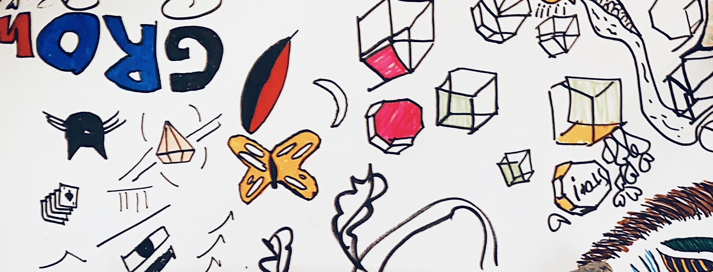

# **Reflective Journal** for *Frid Wright*

 The purpose of this journal is to reflect on my prototyping work for CART 253. 

1. ### First Journal Entry *14/09/2026*
 
 Using the Markdown "Cheat Sheet" (https://www.markdownguide.org/cheat-sheet/) made creating and formatting my README much more straightforward than I had originally assumed. Just like learning any other language, it's done by immersion and practice. I spend all weekdays at a language school, I'm confident that I will be able to sychronously learn another one by dedicating a few nights a week to another... my brain is already in that mode anyway, might as well try to capitalize on that flow. Memorization to reach fluency may prove a challenge, but "do by doing" and all will follow. My goal for this course is to build something interesting, functional, maybe even cool, however simple the final product may be. The beginner simplicity may elicit an internal struggle due to not being able to actualize my intentions into code, as I am used to more flowery mediums. Will focus more on function and design, over beauty. Let's see!  

 
2. ### Second Journal Entry

3. ### Third Journal Entry