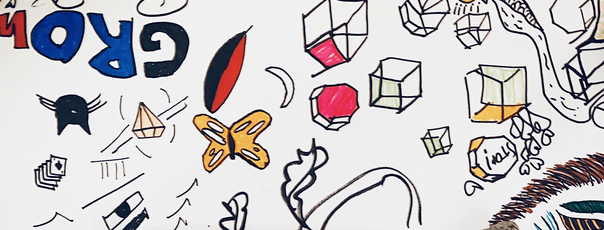

# **Reflective Journal** for *Frid Wright*

*The purpose of this journal is to reflect on my prototyping work for CART 253.*

1. ### <u>First Journal Entry</u> *14/09/2026*
 Using the Markdown ["Cheat Sheet"](https://www.markdownguide.org/cheat-sheet/) made creating and formatting the README much more straightforward than I had originally assumed. Just like learning any other language, I assume it's done by immersion and practice. I spend all weekdays at a language school, so I have confidence that I will be able to sychronously learn another by applying my time... my brain is already in that mode anyway, might as well try to capitalize on that flow. Memorization to reach fluency may prove a challenge, but "do by doing" and all will follow, yes?
 
 In addition to Markdown, getting used to GitHub and it's *staging, committing*, and *pushing to origin* steps seems very manageable. I also appreciate using a single unified repository for all future coursework. Having everything centralized in one place makes the whole development cycle feel organized.
 
 My goal for this course is to build something interesting, functional, maybe even cool, however simple the final product may be. The beginner simplicity may elicit an intial internal struggle due to not being able to actualize my artistic intentions into code, as I am used to more flowery freeform mediums. Will focus more on function and design, over beauty, to start. *Let's see*!
 
2. ### <u>Second Journal Entry</u> *28/09/2026*
This journal entry reflects on my process across the three drawings created for the [Prototyping: Instructions assignment.](https://github.com/FridWright/cart253/blob/main/prototyping-instructions.md) 

My first drawing, *Lime Balls*, was an exercise in basic shapes, fill colors and text, which I hope to build on later by adding bouncing physics to the lime/lemon balls. 

My second drawing, *Quadrant*, focused on spatial symmetry and canvas partitioning with rect(), creating concentric circles, and practicing the use of positioning variables (width / 2, height / 2). In a future edit, I want to make it interactive by swapping quadrant colors based on mouse movement or an audio. 

My third drawing, *Night Waves*, was the most technically complex, and I utilized many references from the p5.js library to create a sea/sky scape. I used paletteLerp() for sky colour transitions, noise() for animated lower waves, and randomSeed() to lock a flickering starry sky in place without the flickering. In the future, I want to explore custom vector geometry using vertex() and bezierVertex() to draw a true crescent moon -*along other more complex shapes*- for all these drawings. 

3. ### <u>Third Journal Entry</u> *30/09/2026*
This journal entry reflects on my process of the [Prototyping: Variables assignment.](https://github.com/FridWright/cart253/blob/main/prototyping-variables.md)

My first prototype, *Stereo Rings*, features a pulsing visualizer built from nested concentric circles that continuously expand and contract. I used animation variables (coreSize, pulseSpeed, minSize, maxSize) with directional boundary checks (if (coreSize > maxSize || coreSize < minSize)) to create the pulsing loop. Proportional multipliers (0.75, 0.5, 0.25) scale the inner ellipse() rings dynamically, while dist() calculates cursor proximity to expand the outer stroke aura (auraSize) when the mouse hovers nearby.

My second prototype, *Tether*, is a follower circle connected to the mouse cursor by a visual tether that lags behind and reacts dynamically to movement speed. I implemented smooth delay using linear easing math (followerX += (mouseX - followerX) * easing), calculated mouse-to-follower distance with dist(), and used line() for the connecting tether. The follower (ellipse()) dynamically inflates in size based on distance while changing color from white to purple using map() and lerpColor(). 

The third prototype, *Bloom*, is an interactive growth sketch where a flower sprouts and blooms when watering the pot. It is built using variables (flowerY, petalSize) modified inside mousePressed() upon clicking the pot's quad() collision area, noCursor() combined with custom triangle() and ellipse() shapes for the water-drop cursor, and layered ellipse() shapes for proportional petal expansion.

Throughout the *Prototyping: Variables* Assignment, I relied heavily on p5.js references and found it essential for implementing functions like dist(), lerpColor(), and mousePressed().

4. ### <u>Third Journal Entry ⏰</u>

5. ### <u>Third Journal Entry ⏰</u>

6. ### <u>Third Journal Entry ⏰</u>

7. ### <u>Third Journal Entry ⏰</u>

8. ### <u>Third Journal Entry ⏰</u>