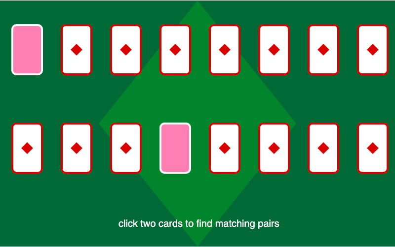
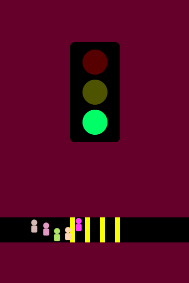
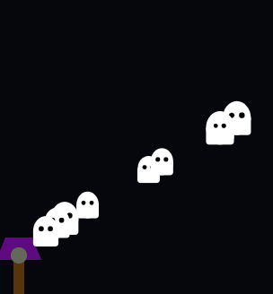

# **Prototyping: Conditionals** 
> ## by *Frid Wright* 05/10/2026

## Objectives
1. Get comfortable with conditionals and the glory of choice
2. Experimenting with what kinds of things a conditional can “mean”
3. Experimenting with which qualities of your program can be affected/controlled by conditionals
4. Trying out further interactivity with mouse variables combined with conditionals

## Deliverables

### 1. Prototype One - Match Game [view here](https://fridwright.github.io/cart253/topics/prototyping-conditionals/match-game/)

### 2. Prototype Two - Crosswalk [view here](https://fridwright.github.io/cart253/topics/prototyping-conditionals/crosswalk/)

### 3. Prototype Three - Ghosts [view here](https://fridwright.github.io/cart253/topics/prototyping-conditionals/ghosts/)

> ## Link to Reflective Journal: 📚[click here](journal.md)