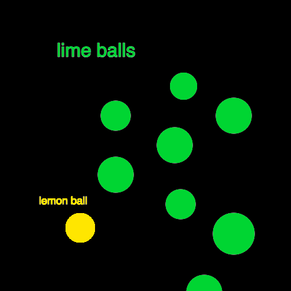

# **Prototyping: Instructions** 
> ## by *Frid Wright* 22/09/2026

## Objectives
1. Get comfortable with starting, coding, and distributing your work
2. Develop familiarity with the p5 library and its built-in drawing functions
3. Develop an understanding how combinations of drawing instructions create images
4. Build confidence in playing with arguments to functions

## Deliverables

### 1. Prototype One - Lime Balls [view here](https://fridwright.github.io/cart253/topics/prototyping-instructions/lime-balls/)

### 2. Prototype Two - Quadrant [view here](https://fridwright.github.io/cart253/topics/prototyping-instructions/quadrant/)

[INSERT IMAGE HERE]

### 3. Prototype Three

[INSERT IMAGE HERE]

> ## Link to Reflective Journal: [click here](journal.md)