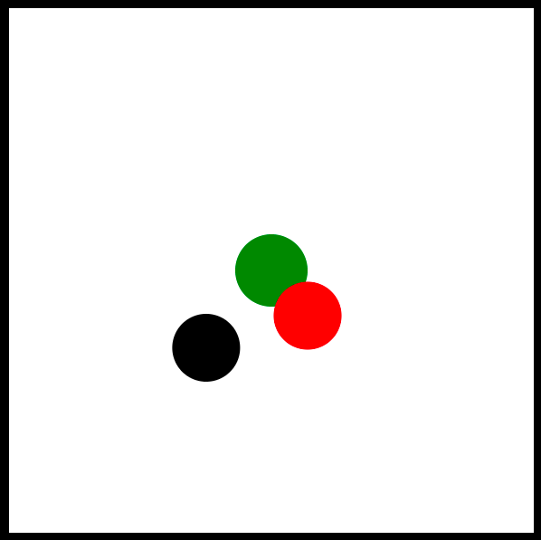

# Conditionals Challenge (In-Class)

Fridrikka Wright

[View this project online](https://fridwright.github.io/cart253/topics/conditionals-challenge/)

 
## Description

This is a program in which the user can push a around a red puck(1) with their black puck, and if they move red puck(1) onto the other red puck(2) in center screen, it will turn green!

## Attribution

> - This project uses [p5.js](https://p5js.org).
> - The example base code for this project is taken from [Pippin Barr's example](https://pippinbarr.com/cart253/assignments/challenges/conditionals/).

## License

> This project is licensed under a Creative Commons Attribution ([CC BY 4.0](https://creativecommons.org/licenses/by/4.0/deed.en)) license with the exception of libraries and other components with their own licenses.